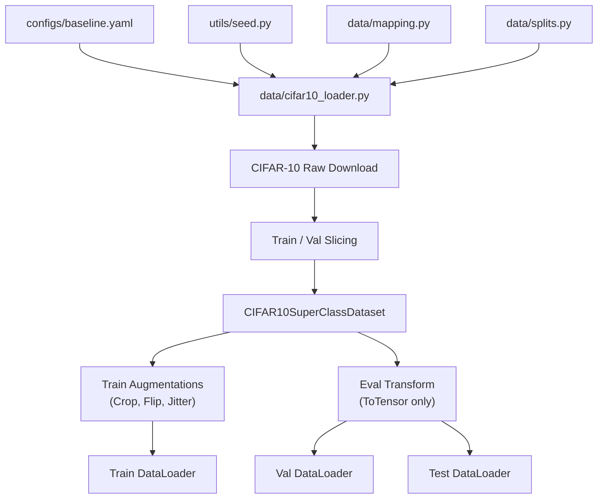

# Adversarial ML Assessment: Document Fraud Detection Proxy

This project implements an end-to-end Adversarial Machine Learning (AML) evaluation pipeline for a document fraud detection system using CIFAR-10 as a proxy dataset. 

The system classifies images into three super-classes representing document states: **Genuine**, **Tampered**, and **Forged**.

---

## 1. Proxy Dataset Mapping Justification

Because proprietary real-world fraud document datasets are not available, CIFAR-10 classes are mapped to a 3-class taxonomy to simulate fraud patterns:

| CIFAR-10 Original Class | Target Super-Class Index | Target Super-Class Name | Fraud Domain Analogy / Justification |
| :--- | :---: | :---: | :--- |
| `airplane`, `automobile`, `ship`, `truck` | **0** | **Genuine** | Vehicle classes represent standard, unmodified transport items. In the document domain, these map to valid, standard template layouts with no anomalous characteristics. |
| `bird`, `cat`, `deer`, `dog` | **1** | **Tampered** | Natural animals are similar in nature. In the document domain, this simulates a genuine document that has undergone minor alterations (e.g., modified text field, cropped photo, or overlay). |
| `frog`, `horse` | **2** | **Forged** | Distinct animal types (amphibian vs mammal). In the document domain, this simulates completely simulated/fabricated documents generated from scratch using invalid layouts or synthetic generator patterns. |

This taxonomy simulates a realistic fintech document classification system where the model must distinguish between clean documents, slightly altered files, and complete counterfeits.

---

## 2. Data Pipeline Architecture & Component Interaction

The Data Pipeline component is designed to be a modular, reproducible, and self-contained subsystem:



### Module Roles:
1. **[utils/seed.py](file:///c:/Users/dell/Desktop/New%20project/adversarial-ml-assessment/utils/seed.py)**: Centralizes random seed configurations across `random`, `numpy`, `torch`, and CUDA to guarantee determinism in data shuffling and partitioning.
2. **[data/mapping.py](file:///c:/Users/dell/Desktop/New%20project/adversarial-ml-assessment/data/mapping.py)**: The single source of truth for the 10-to-3 class mapping. Maps class names (strings) and class indices (integers) to super-class labels.
3. **[data/splits.py](file:///c:/Users/dell/Desktop/New%20project/adversarial-ml-assessment/data/splits.py)**: Uses a local seeded random generator to partition training indices into disjoint train (e.g. 90%) and validation (e.g. 10%) subsets.
4. **[data/cifar10_loader.py](file:///c:/Users/dell/Desktop/New%20project/adversarial-ml-assessment/data/cifar10_loader.py)**: Wraps torchvision datasets, manages indices slicing, defines transform pipelines, and exports the `get_dataloaders(config_path)` factory.

---

## 3. How Downstream Components Consume the Data Pipeline

Downstream components (like the **Baseline Training** or **Adversarial Evaluation** stages) should consume this pipeline as follows:

```python
from data.cifar10_loader import get_dataloaders

# 1. Load dataloaders from the central baseline config
train_loader, val_loader, test_loader = get_dataloaders("configs/baseline.yaml")

# 2. Iterate through batches in the training loop
for images, labels in train_loader:
    # images: FloatTensor of shape (batch_size, 3, 32, 32) in range [0.0, 1.0]
    # labels: LongTensor of shape (batch_size,) containing values in {0, 1, 2}
    
    # Forward pass through model
    outputs = model(images)
    loss = criterion(outputs, labels)
    
    # Optimize
    optimizer.zero_grad()
    loss.backward()
    optimizer.step()
```

### Key Preprocessing Property:
Image tensors yielded by all dataloaders are scaled to `[0.0, 1.0]` (using `transforms.ToTensor()`) with **no** mean/std normalization. This range is preserved so that downstream Adversarial Robustness Toolbox (ART) wrappers can safely process images using bounds `clip_values=(0.0, 1.0)` without normalization mismatches or leakage.
