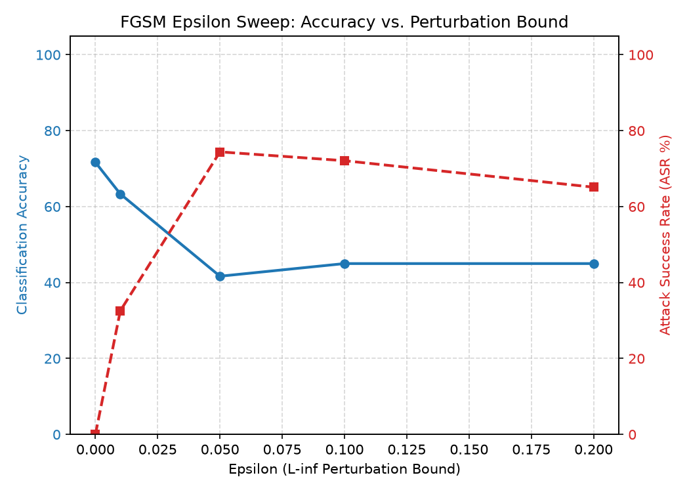

# Task B: Adversarial Evaluation Report

## Summary of Robustness Evaluation
This report evaluates the baseline `FraudCNN` model against white-box evasion attacks across varying perturbation norms ($L_\infty$ and $L_2$).

**Clean Test Set Baseline Accuracy**: `71.67%`
**Most Vulnerable Superclass Overall**: `Tampered` (Average ASR: `66.67%`)

---

## 1. Fast Gradient Sign Method (FGSM) Sweep
Single-step $L_\infty$ perturbation sweep evaluating baseline degradation.

| Epsilon (L-inf Bound) | Adversarial Accuracy (%) | Attack Success Rate (%) | Mean L-inf Norm | Mean L2 Norm |
| :--- | :--- | :--- | :--- | :--- |
| `0.01` | `63.33%` | `32.56%` | `0.0100` | `0.5527` |
| `0.05` | `41.67%` | `74.42%` | `0.0500` | `2.7439` |
| `0.10` | `45.00%` | `72.09%` | `0.1000` | `5.4235` |
| `0.20` | `45.00%` | `65.12%` | `0.2000` | `10.5718` |

---

## 2. Projected Gradient Descent (PGD) Evaluation
Iterative multi-step attack comparison at $\epsilon = 0.05$, step size $\alpha = 0.01$.

| Step Budget | Adversarial Accuracy (%) | Attack Success Rate (%) | Mean L-inf Norm | Mean L2 Norm |
| :--- | :--- | :--- | :--- | :--- |
| `20` | `25.00%` | `95.35%` | `0.0500` | `2.4645` |
| `40` | `25.00%` | `95.35%` | `0.0500` | `2.5114` |

---

## 3. Carlini & Wagner (C&W) L2 Targeted/Untargeted Evaluation
Optimization-based minimum distortion evaluation on `55` stratified test samples.

- **Adversarial Accuracy**: `67.27%`
- **Attack Success Rate (ASR)**: `5.26%`
- **Mean L2 Distortion**: `0.0025`
- **Mean L-inf Norm**: `0.0003`

---

## 4. Per-Class Vulnerability Analysis
Breakdown of Attack Success Rate (ASR %) across proxy document superclasses.

| Attack Regime | Genuine (%) | Tampered (%) | Forged (%) |
| :--- | :--- | :--- | :--- |
| `FGSM (eps=0.2)` | `36.36%` | `100.00%` | `75.00%` |
| `PGD (40-step)` | `90.91%` | `100.00%` | `100.00%` |
| `C&W (L2)` | `5.88%` | `0.00%` | `25.00%` |
