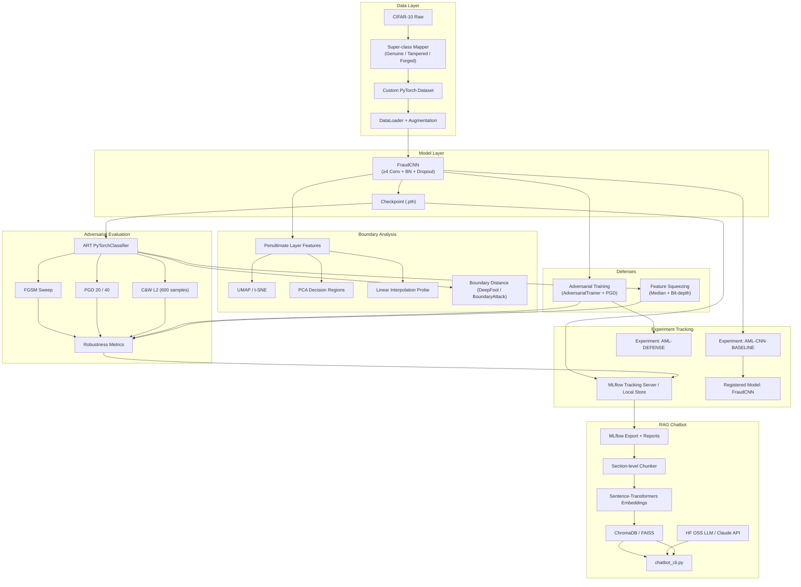
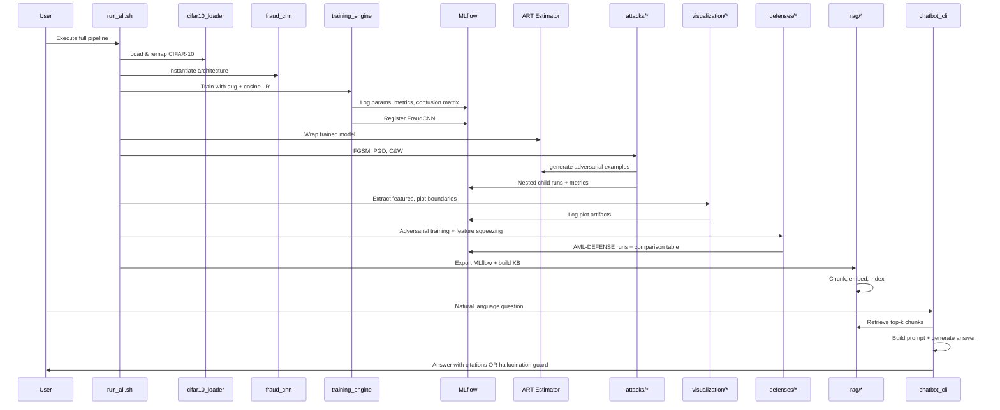
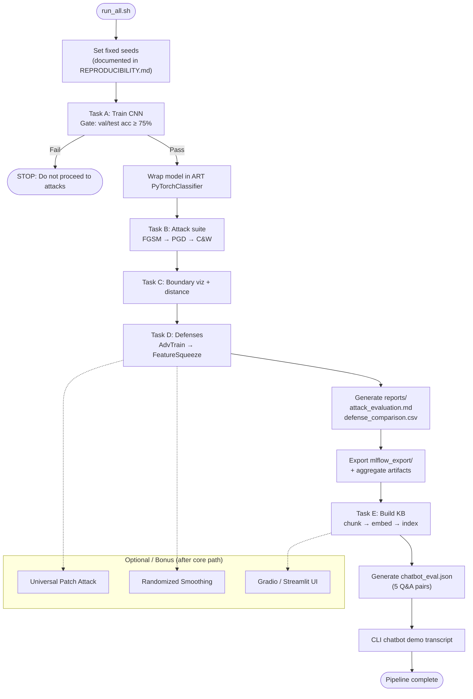

# Technical Blueprint: Adversarial ML Assessment (Document Fraud Detection Proxy)

This document is the pre-implementation planning artifact for the AgentsArchitects.ai assessment. No code is included.

---

## SECTION 1 – Project Overview

### Business Problem

A fintech startup deploys computer vision models to classify scanned documents as **Genuine**, **Tampered**, or **Forged**. Before go-live, regulators and internal red teams require **demonstrable adversarial robustness**: evidence that the model behaves predictably under evasion attacks, that defenses are benchmarked fairly, and that non-technical stakeholders can interrogate results without reading raw experiment logs.

Because real fraud-labeled document data is unavailable in this assessment, **CIFAR-10 serves as a proxy dataset** with a 3-class super-class mapping that mimics a multi-class fraud taxonomy.

### Technical Objective

Build an end-to-end ML system that:

1. Trains a **from-scratch CNN** (no ImageNet pretraining) on the proxy dataset with ≥75% clean test accuracy.
2. Runs a **systematic adversarial attack campaign** via IBM ART (FGSM, PGD, C&W).
3. **Visualizes decision boundaries** and quantifies boundary proximity.
4. Implements and benchmarks **two ART defenses** (adversarial training, feature squeezing).
5. Tracks everything in **MLflow** with reproducible, nested experiment structure.
6. Delivers a **RAG chatbot** that answers only from exported experiment artifacts, with citations and a hallucination guard.

### What the Final System Will Look Like

At completion, the system is a **reproducible pipeline repository** with:

| Layer | What exists |
|---|---|
| Data | CIFAR-10 loader with 3-class remapping, augmentation, fixed seeds |
| Model | `FraudCNN` checkpoint registered in MLflow |
| Experiments | MLflow experiments `AML-CNN-BASELINE`, attack nested runs, `AML-DEFENSE` |
| Analysis | Attack report (MD/PDF), boundary plots (PNG/SVG), defense comparison CSV |
| Knowledge | `mlflow_export/` structured text + chunked embeddings |
| Interface | `chatbot_cli.py` (+ optional Gradio UI) |
| Orchestration | `run_all.sh` executing train → attack → visualize → defend → export → RAG demo |
| Documentation | README, REPRODUCIBILITY.md, 1-page summary PDF |

Stakeholders run one script (or staged scripts) and get artifacts + a chatbot that cites real experiment outputs.

### Complete Workflow: Data Ingestion → Chatbot

```
CIFAR-10 Download
      ↓
Super-class Mapping (10 → 3 classes)
      ↓
Custom Dataset + Augmented DataLoader
      ↓
CNN Training (PyTorch, from scratch)
      ↓
MLflow Logging (AML-CNN-BASELINE) + Register FraudCNN
      ↓
ART PyTorchClassifier Wrapper
      ↓
Attack Campaign (FGSM sweep, PGD 20/40, C&W subset)
      ↓
Robustness Metrics + Nested MLflow Runs
      ↓
Decision Boundary Visualization + Distance Analysis
      ↓
Defense Training (Adversarial Training, Feature Squeezing)
      ↓
Defense Comparison Table → MLflow Artifact
      ↓
Export MLflow Runs + Reports → Structured Documents
      ↓
Section-level Chunking + Embedding + Vector Store
      ↓
RAG CLI Chatbot (retrieve → prompt → cite → hallucination guard)
      ↓
chatbot_eval.json + Demo Transcript
```

### Architecture Diagram



### Data Flow Diagram

```mermaid
flowchart LR
    subgraph Ingestion
        A1["CIFAR-10 images\n(32×32×3)"]
        A2["Original labels\n(0–9)"]
    end

    subgraph Transform
        B1["Label remap\n→ {0:Genuine, 1:Tampered, 2:Forged}"]
        B2["Normalize / Augment\ncrop, flip, jitter"]
    end

    subgraph TrainPath
        C1["Train/Val/Test splits"]
        C2["Batches → CNN"]
        C3["Logits → Cross-Entropy"]
        C4["Metrics: loss, acc,\nconfusion matrix"]
    end

    subgraph AttackPath
        D1["Test batch (clean)"]
        D2["ART attack generate()"]
        D3["Adversarial images"]
        D4["Predict + compare labels"]
        D5["Perturbation norms\nL∞, L2"]
    end

    subgraph KnowledgePath
        E1["MLflow runs JSON/CSV"]
        E2["Reports MD/CSV/PDF text"]
        E3["Section chunks + metadata"]
        E4["Embeddings → vector index"]
        E5["Query → top-k chunks → LLM prompt"]
    end

    A1 --> B1
    A2 --> B1 --> B2 --> C1 --> C2 --> C3 --> C4
    C2 --> D1 --> D2 --> D3 --> D4 --> D5
    C4 --> E1
    D5 --> E1
    E1 --> E2 --> E3 --> E4 --> E5
```



### Component Interaction Diagram



### Execution Pipeline Diagram



---

## SECTION 2 – Requirement Analysis

Each requirement is traced to the specification. Items marked **Ambiguity** flag unclear spec language.

---

### Technical Context & Scenario

| Field | Detail |
|---|---|
| **Requirement** | Fintech document fraud detection context; model classifies Genuine / Tampered / Forged; adversarial robustness required before go-live |
| **Why it exists** | Sets the real-world framing; justifies attacks, defenses, and stakeholder chatbot |
| **Inputs** | Proxy dataset (CIFAR-10), regulatory/red-team expectations |
| **Outputs** | Robustness evidence, explainability tooling |
| **Dependencies** | None (context) |
| **Deliverables** | README narrative, 1-page summary PDF |
| **Acceptance criteria** | README and summary reflect fraud-detection motivation and limitations of proxy data |
| **Common beginner mistakes** | Treating CIFAR-10 results as directly transferable to document fraud without stating proxy limitations |

---

### Proxy Dataset Mapping

| Field | Detail |
|---|---|
| **Requirement** | Use CIFAR-10; map to 3 super-classes: Genuine (airplane, automobile, ship, truck), Tampered (bird, cat, deer, dog), Forged (frog, horse); justify mapping in README |
| **Why it exists** | Simulates multi-class fraud taxonomy without proprietary data |
| **Inputs** | CIFAR-10 original 10-class labels |
| **Outputs** | Remapped 3-class labels for all splits |
| **Dependencies** | torchvision CIFAR-10 API |
| **Deliverables** | `data/cifar10_loader.py`, README justification section |
| **Acceptance criteria** | Every sample mapped consistently; justification is explicit and defensible (e.g., "vehicle/transport vs animals vs distinct classes") |
| **Common beginner mistakes** | Mapping at DataLoader time inconsistently; train/test label leakage via wrong split handling; weak or missing README justification |

**Ambiguity:** Spec does not define whether original 10-class metrics should also be reported. Recommendation: report only 3-class unless you document otherwise.

---

### Task A1 – Architecture Requirements

| Field | Detail |
|---|---|
| **Requirement** | Minimum 4 convolutional layers with batch normalization and dropout; justify filter sizes and depth in code comments; ≥75% clean accuracy on held-out test split; custom PyTorch Dataset + DataLoader with augmentation (random crop, horizontal flip, colour jitter) |
| **Why it exists** | Ensures non-trivial CNN design and proper data pipeline before adversarial work |
| **Inputs** | Remapped CIFAR-10 tensors, augmentation config |
| **Outputs** | Trained model meeting accuracy gate |
| **Dependencies** | Task A dataset mapping |
| **Deliverables** | `models/fraud_cnn.py`, `data/cifar10_loader.py` |
| **Acceptance criteria** | Architecture inspectable (≥4 conv layers with BN + dropout); test accuracy ≥75%; all three augmentations applied in training pipeline |
| **Common beginner mistakes** | Counting linear layers as conv layers; applying augmentation to validation/test; using pretrained weights (prohibited); training on test set |

---

### Task A2 – Training Setup

| Field | Detail |
|---|---|
| **Requirement** | Optimizer: Adam or AdamW with cosine annealing LR schedule; loss: cross-entropy; log train and validation loss and accuracy per epoch; save final checkpoint in MLflow as registered model artifact |
| **Why it exists** | Reproducible training with standard optimization and experiment traceability |
| **Inputs** | Model, train/val loaders, hyperparameters |
| **Outputs** | Per-epoch metrics, final checkpoint |
| **Dependencies** | A1 architecture and data pipeline |
| **Deliverables** | Training script/module, MLflow logged metrics |
| **Acceptance criteria** | Every epoch logs train + val loss and accuracy; cosine schedule verifiable in code; checkpoint present in MLflow artifacts |
| **Common beginner mistakes** | Logging only training metrics; forgetting to load best vs final checkpoint consistently for downstream ART; not matching preprocessing between train and ART `clip_values` |

**Ambiguity:** "Held-out test split" vs "validation" for the 75% gate. Recommendation: use official CIFAR-10 test set for the gate; use train split with a validation holdout for early monitoring during training.

---

### Task A3 – MLflow Experiment Tracking (Baseline)

| Field | Detail |
|---|---|
| **Requirement** | Experiment name `AML-CNN-BASELINE`; log all hyperparameters, per-epoch metrics, confusion matrix artifact, model checkpoint under registered model name `FraudCNN`; use autolog where applicable, manual override where needed |
| **Why it exists** | Central audit trail for baseline model; feeds RAG knowledge base |
| **Inputs** | Training loop outputs |
| **Outputs** | MLflow run with params, metrics, artifacts, registered model |
| **Dependencies** | A2 training |
| **Deliverables** | MLflow experiment runs, registered `FraudCNN` |
| **Acceptance criteria** | Experiment name exact; confusion matrix PNG/CSV in artifacts; `FraudCNN` registrable and loadable |
| **Common beginner mistakes** | Wrong experiment name; logging final metric only (not per-epoch); not registering model (only logging artifact path); autolog duplicating manual logs |

---

### Task B1 – Required Attack Implementations

#### FGSM

| Field | Detail |
|---|---|
| **Requirement** | FGSM with epsilon sweep [0.01, 0.05, 0.1, 0.2]; plot accuracy-vs-epsilon curve |
| **Why it exists** | Baseline single-step attack; shows sensitivity to perturbation budget |
| **Inputs** | Clean test set, ART classifier, epsilon values |
| **Outputs** | Per-epsilon adversarial accuracy, plot |
| **Dependencies** | Trained model wrapped in ART |
| **Deliverables** | `attacks/fgsm_sweep.py`, plot in attack report |
| **Acceptance criteria** | All 4 epsilons evaluated; monotonic accuracy degradation expected (document if not); curve saved as artifact |
| **Common beginner mistakes** | Wrong epsilon scale (not normalized to [0,1]); using test labels in attack (FGSM is typically untargeted but still shouldn't leak split logic) |

#### PGD

| Field | Detail |
|---|---|
| **Requirement** | PGD 20-step and 40-step variants; compare attack strength |
| **Why it exists** | Strong iterative attack; standard robustness benchmark |
| **Inputs** | Clean test set, step count, step size (must be chosen and documented) |
| **Outputs** | Adversarial accuracy for 20- and 40-step PGD |
| **Dependencies** | ART classifier |
| **Deliverables** | `attacks/pgd_attack.py`, comparison in report |
| **Acceptance criteria** | 40-step attack ≤ accuracy of 20-step at same epsilon (typically); comparison discussed in README/report |
| **Common beginner mistakes** | Not setting `max_iter` correctly; random restart omitted without documentation; inconsistent epsilon across FGSM and PGD |

**Ambiguity:** PGD hyperparameters (step size, epsilon, norm) not fully specified. Must document chosen values in README and MLflow params.

#### C&W L2

| Field | Detail |
|---|---|
| **Requirement** | Run on stratified sample of 200 images per class; report mean L2 distortion and success rate |
| **Why it exists** | Optimization-based attack; measures minimal perturbation to fool model |
| **Inputs** | 600 test images (200 × 3 classes), ART CarliniL2Method |
| **Outputs** | Mean L2 distortion, attack success rate |
| **Dependencies** | ART classifier, test set with class labels |
| **Deliverables** | `attacks/cw_attack.py`, metrics in report |
| **Acceptance criteria** | Exactly stratified 200/class; L2 and ASR reported; runtime documented (C&W is slow) |
| **Common beginner mistakes** | Random sample without stratification; reporting L∞ instead of L2; running on full test set without noting deviation |

#### Patch Attack (Bonus)

| Field | Detail |
|---|---|
| **Requirement** | Universal adversarial patch; demonstrate transfer to second victim model |
| **Why it exists** | Bonus: physical-world-relevant threat model |
| **Inputs** | Patch optimization setup, two models |
| **Outputs** | Patch visualization, transfer demo |
| **Dependencies** | Baseline + second model (must be trained separately) |
| **Deliverables** | Patch script + visualization |
| **Acceptance criteria** | Patch fools model; transfer shown on second model |
| **Common beginner mistakes** | Using same model twice; no second victim trained from scratch |

---

### Task B2 – ART Estimator Wrapping

| Field | Detail |
|---|---|
| **Requirement** | All attacks wrapped in ART estimators; example shows `PyTorchClassifier` with input_shape (3,32,32), nb_classes=3, clip_values=(0.0,1.0); each attack in its own MLflow nested child run |
| **Why it exists** | Consistent API across attacks/defenses; traceable experiment hierarchy |
| **Inputs** | PyTorch model, loss, optimizer, numpy tensors |
| **Dependencies** | Trained checkpoint |
| **Deliverables** | Shared ART wrapper module, nested MLflow runs |
| **Acceptance criteria** | No attack bypasses ART; nested runs visible under parent attack campaign run |
| **Common beginner mistakes** | `clip_values` mismatch with actual pixel range; forgetting `model.eval()`; ART expecting NHWC vs NCHW confusion; not using nested runs |

**Ambiguity:** Parent run structure for nested runs not defined. Recommendation: one parent run `attack_campaign` with children `fgsm_eps_0.01`, `pgd_20step`, etc.

---

### Task B3 – Robustness Metrics

| Field | Detail |
|---|---|
| **Requirement** | Report: clean vs adversarial accuracy per attack; average perturbation magnitude (L∞ and L2); attack success rate (ASR) and fooling rate; per-class vulnerability analysis |
| **Why it exists** | Complete robustness picture for regulators and viva |
| **Inputs** | Clean/adv predictions, perturbations |
| **Outputs** | Tables, per-class breakdown |
| **Dependencies** | All B1 attacks |
| **Deliverables** | `reports/attack_evaluation.md` (+ plots) |
| **Acceptance criteria** | All metrics defined consistently in README; per-class analysis identifies most vulnerable super-class |
| **Common beginner mistakes** | Conflating ASR and fooling rate; per-class analysis on wrong granularity (10-class vs 3-class); not reporting clean baseline alongside each attack |

**Ambiguity:** ASR vs fooling rate definitions not given. Document definitions explicitly (e.g., ASR = misclassification rate under attack; fooling rate = fraction where pred ≠ true label for originally correct clean samples).

---

### Task C1 – 2D Projection Techniques (≥2 required)

#### UMAP or t-SNE

| Field | Detail |
|---|---|
| **Requirement** | Project penultimate layer activations of clean and adversarial test samples; side-by-side plots colored by true class and predicted class |
| **Why it exists** | Visualize feature space collapse under attack |
| **Inputs** | Penultimate layer features (clean + adv), labels |
| **Outputs** | PNG/SVG plots |
| **Dependencies** | Trained model, adversarial examples from B |
| **Deliverables** | `visualization/umap_plot.py` (or t-SNE equivalent) |
| **Acceptance criteria** | Penultimate layer correctly hooked; clean vs adv side-by-side; dual coloring scheme |
| **Common beginner mistakes** | Fitting UMAP on combined data without noting leakage (acceptable for viz but document); using final layer logits instead of penultimate; wrong layer hook in sequential model |

#### PCA with Decision Regions

| Field | Detail |
|---|---|
| **Requirement** | Reduce to 2 PCs; render decision regions (mlxtend or custom matplotlib); overlay clean and adversarial points |
| **Why it exists** | Shows classifier regions and boundary crossings |
| **Inputs** | Features or input space PCA (spec says "2 principal components" on activations—clarify in README), trained classifier |
| **Outputs** | Decision region plot with overlays |
| **Dependencies** | Model forward pass for region prediction |
| **Deliverables** | `visualization/pca_regions.py` |
| **Acceptance criteria** | Regions rendered; clean/adv points visible |
| **Common beginner mistakes** | PCA in pixel space vs activation space without stating which; decision regions computed in 2D PCA space but classifier is high-dimensional (must project or approximate—document methodology) |

**Ambiguity:** Decision regions in PCA space require projecting classifier into 2D or evaluating on inverse-projected grid. Spec allows mlxtend (typically for 2-feature input). **Engineering decision:** Fit PCA on penultimate activations, train a lightweight 2D classifier for region visualization only, OR evaluate model on samples mapped through inverse PCA approximation—document choice clearly for viva.

#### Linear Interpolation Boundary Probe

| Field | Detail |
|---|---|
| **Requirement** | 20 clean-adversarial pairs; plot model confidence along linear path; identify boundary crossing point |
| **Why it exists** | Measures margin and local linearity of decision boundary |
| **Inputs** | 20 (x_clean, x_adv) pairs, model softmax outputs |
| **Outputs** | 20 confidence curves, crossing fractions |
| **Dependencies** | Adversarial examples |
| **Deliverables** | `visualization/boundary_probe.py` |
| **Acceptance criteria** | 20 pairs; confidence vs interpolation parameter α∈[0,1]; crossing point identified per pair |
| **Common beginner mistakes** | Interpolating in pixel space without clipping to [0,1]; reporting class label flip but not confidence crossing |

---

### Task C2 – Boundary Distance Analysis

| Field | Detail |
|---|---|
| **Requirement** | Compute minimum L2 distance to nearest decision boundary using ART BoundaryAttack or DeepFool variant; report mean distance per class; correlate with Task B per-class ASR; discuss uniform vs class-specific robustness in README |
| **Why it exists** | Quantitative link between geometry and attack vulnerability |
| **Inputs** | Test samples, ART attack for boundary distance |
| **Outputs** | Per-class mean distances, correlation analysis |
| **Dependencies** | Task B per-class metrics |
| **Deliverables** | Analysis section in README + report artifacts |
| **Acceptance criteria** | Method named and justified; per-class table; explicit correlation discussion |
| **Common beginner mistakes** | Running BoundaryAttack on full test set (prohibitively slow); confusing DeepFool perturbation norm with boundary distance; no statistical correlation (even qualitative is required) |

**Ambiguity:** "Minimum L2 distance to nearest decision boundary" is computationally hard; DeepFool provides approximate minimal perturbation—not identical to boundary distance. Document approximation clearly.

---

### Task D1 – Required Defenses

#### Adversarial Training

| Field | Detail |
|---|---|
| **Requirement** | Fine-tune baseline CNN using ART `AdversarialTrainer` with PGD-generated examples; ≥10 additional epochs; log in MLflow experiment `AML-DEFENSE` |
| **Why it exists** | Primary robust training defense |
| **Inputs** | Baseline checkpoint, PGD attack config |
| **Outputs** | Robust fine-tuned model, MLflow runs |
| **Dependencies** | Task A model, Task B PGD attack config |
| **Deliverables** | `defenses/adversarial_training.py` |
| **Acceptance criteria** | Experiment name exact; ≥10 epochs; improved PGD robustness (typically at some clean acc cost) |
| **Common beginner mistakes** | Training from scratch instead of fine-tuning; too-strong PGD breaking training; not logging clean acc alongside robust acc |

#### Feature Squeezing

| Field | Detail |
|---|---|
| **Requirement** | Median smoothing + bit-depth reduction preprocessing; ART `FeatureSqueezing` wrapper; tune and justify parameters |
| **Why it exists** | Inference-time defense without retraining |
| **Inputs** | Test images, squeezing hyperparameters |
| **Outputs** | Robustness metrics under same attack suite |
| **Dependencies** | ART classifier, attack scripts |
| **Deliverables** | `defenses/feature_squeezing.py` |
| **Acceptance criteria** | Both squeezing methods applied; parameters logged and justified |
| **Common beginner mistakes** | Applying squeezing during training unintentionally; evaluating without wrapping preprocessor in ART pipeline; extreme squeezing destroying clean accuracy without discussion |

---

### Task D2 – Optional Defense (Bonus)

| Field | Detail |
|---|---|
| **Requirement** | Randomized Smoothing via ART `SmoothClassifier`; report certified accuracy at radius r=0.25 |
| **Why it exists** | Certified robustness bonus |
| **Inputs** | Base classifier, noise sigma, n_samples |
| **Outputs** | Certified accuracy at r=0.25 |
| **Dependencies** | Baseline model |
| **Deliverables** | Optional defense module |
| **Acceptance criteria** | Certification radius 0.25 reported; methodology documented |
| **Common beginner mistakes** | Confusing empirical robust accuracy with certified accuracy; insufficient Monte Carlo samples |

---

### Task D3 – Defense Comparison Table

| Field | Detail |
|---|---|
| **Requirement** | Table columns: Model Variant, Clean Accuracy, FGSM Accuracy (eps=0.05), PGD-40 Accuracy, C&W Success Rate, Training Overhead (hours); logged as MLflow artifact |
| **Why it exists** | Single view for stakeholders and RAG |
| **Inputs** | Metrics from baseline, adv-trained, feature squeezing |
| **Outputs** | CSV/Markdown + MLflow artifact |
| **Dependencies** | Tasks B and D1 complete |
| **Deliverables** | `reports/defense_comparison.csv` |
| **Acceptance criteria** | All columns populated; fair comparison (same test sets); overhead in wall-clock hours tracked |
| **Common beginner mistakes** | Different test subsets across rows; C&W SR column inconsistent with Task B methodology; not logging as MLflow artifact |

---

### Task E1 – Knowledge Base Construction

| Field | Detail |
|---|---|
| **Requirement** | Export all MLflow runs (params, metrics, tags, artifact summaries) to structured text via MLflow tracking API; include README, defense comparison table, boundary distance analysis, per-class attack results; chunk at section level (not sentence); record chunk source metadata for citations |
| **Why it exists** | Grounded chatbot knowledge from actual experiments |
| **Inputs** | MLflow tracking store, report files |
| **Outputs** | Structured text files, chunked corpus with metadata |
| **Dependencies** | All prior tasks producing artifacts |
| **Deliverables** | `rag/build_knowledge_base.py`, `mlflow_export/` |
| **Acceptance criteria** | Section-level chunks; each chunk has source doc + section; no sentence-level fragmentation |
| **Common beginner mistakes** | Exporting only metrics not params; chunking too fine; missing artifact summaries; stale exports not regenerated in `run_all.sh` |

---

### Task E2 – RAG Pipeline

| Field | Detail |
|---|---|
| **Requirement** | Embeddings: sentence-transformers (all-MiniLM-L6-v2 or similar); vector store: ChromaDB or FAISS; LLM: HF open-source (Mistral-7B-Instruct recommended) OR Claude API; explicit pipeline: embed query → retrieve top-k (k≥5) → construct prompt → return answer with citations; NO LangChain/LlamaIndex |
| **Why it exists** | Transparent, auditable RAG for viva |
| **Inputs** | Chunk index, user query |
| **Outputs** | Grounded answer + citations |
| **Dependencies** | E1 knowledge base |
| **Deliverables** | `rag/retriever.py`, prompt builder module |
| **Acceptance criteria** | k≥5; citations include document name + section; logic visible in code |
| **Common beginner mistakes** | Using LangChain "for convenience" (prohibited); k<5; citations missing section granularity; LLM answering from parametric knowledge |

---

### Task E3 – Chatbot Interface

| Field | Detail |
|---|---|
| **Requirement** | CLI required (`chatbot_cli.py`); optional Gradio/Streamlit; must handle performance, attack, defense, boundary, comparison question types (5 examples given) |
| **Why it exists** | Stakeholder access |
| **Inputs** | User natural language queries |
| **Outputs** | Cited answers or hallucination guard |
| **Dependencies** | E2 pipeline |
| **Deliverables** | `rag/chatbot_cli.py`, demo transcript in README |
| **Acceptance criteria** | All 5 question types demonstrably work in transcript |
| **Common beginner mistakes** | Hard-coded answers (prohibited); demo transcript fabricated not from actual runs |

---

### Task E4 – Hallucination Guard

| Field | Detail |
|---|---|
| **Requirement** | If insufficient evidence in retrieved chunks, respond: *"Insufficient evidence in experiment logs. Please consult raw MLflow runs."* Must NOT hallucinate metrics; log 5 sample Q&A pairs in `chatbot_eval.json` as MLflow artifact |
| **Why it exists** | Trust and regulatory safety |
| **Inputs** | Retrieval scores, chunk content |
| **Outputs** | Guard message or grounded answer; eval JSON |
| **Dependencies** | E2, E3 |
| **Deliverables** | `rag/chatbot_eval.json`, MLflow artifact |
| **Acceptance criteria** | Exact guard string; JSON contains query, retrieved chunks, final answer for 5 pairs |
| **Common beginner mistakes** | Guard never triggers; eval JSON missing retrieved chunks; LLM inventing numbers despite prompt instructions |

---

### Deliverables (Section 3 of Spec)

Each row in spec deliverables table is covered in Section 9 checklist.

---

### Evaluation Rubric (Section 4 of Spec)

| Area | Weight | Implication |
|---|---|---|
| CNN Design & Training | 20% | Architecture + ≥75% acc + DataLoader |
| Adversarial Attacks | 25% | Highest weight; all 3 attacks + metrics |
| Decision Boundary | 15% | 2+ viz methods + boundary distance |
| Adversarial Defense | 20% | Both defenses + fair comparison |
| RAG Chatbot | 15% | Grounding + citations + guard |
| MLflow Integration | 5% | Naming, nesting, registration |

---

### Technical Constraints (Section 5)

#### Required Libraries

| Field | Detail |
|---|---|
| **Requirement** | torch≥2.1, torchvision≥0.16, art≥1.17, mlflow≥2.10, sentence-transformers, chromadb or faiss-cpu, OSS LLM or Claude |
| **Why** | Version compatibility across ART/PyTorch/MLflow |
| **Deliverables** | `requirements.txt` with pinned/min versions |
| **Acceptance** | Clean install from requirements |
| **Mistakes** | ART version incompatible with torch 2.x; missing faiss/chroma |

#### Prohibited Approaches

| Prohibition | Acceptance implication |
|---|---|
| No ImageNet pretrained weights | Random or custom init only |
| No AutoAttack as substitute | Each attack manually wrapped |
| No hard-coded chatbot metrics | Answers traceable to chunks |
| No LangChain/LlamaIndex black-box | Explicit retrieve + prompt code |

#### Reproducibility

| Field | Detail |
|---|---|
| **Requirement** | Fixed seeds (torch, numpy, random) in REPRODUCIBILITY.md; `run_all.sh` runs full pipeline; target hardware documented (single GPU ≥8GB or Colab T4); estimated wall-clock time |
| **Deliverables** | `REPRODUCIBILITY.md`, `run_all.sh` |
| **Acceptance** | Re-running produces materially similar metrics; script order correct |
| **Mistakes** | Non-deterministic CUDA ops without documentation; run_all.sh skips steps |

---

### Submission Instructions

| Field | Detail |
|---|---|
| **Requirement** | Public GitHub repo (or private with collaborator access); 1-page summary PDF; submit within 72-hour deadline |
| **Deliverables** | Repo link + `reports/summary.pdf` |
| **Acceptance** | All required deliverables present |

---

### Reference Repository Structure

| Field | Detail |
|---|---|
| **Requirement** | Follow suggested layout; deviations allowed if documented in README |
| **Deliverables** | Folder structure per spec |
| **Acceptance** | Reviewer can navigate without confusion |

---

### Viva Questions (Section 8)

Not implementation requirements, but **preparation deliverables**: you must be able to answer from your actual results for attacks, defenses, boundaries, and RAG failure modes. Build a `docs/viva_prep.md` (optional internal doc) synthesizing answers from logged metrics.

---

## SECTION 3 – Mandatory vs Optional

### Mandatory Tasks

| ID | Task | Grading Impact | Weight Area |
|---|---|---|---|
| M1 | CIFAR-10 → 3-class mapping + README justification | Required deliverable | CNN 20% |
| M2 | Custom Dataset + DataLoader + 3 augmentations | Required | CNN 20% |
| M3 | CNN ≥4 conv + BN + dropout, from scratch | Required | CNN 20% |
| M4 | ≥75% clean test accuracy gate | Blocks Tasks B–E | CNN 20% |
| M5 | Adam/AdamW + cosine annealing + CE loss | Required | CNN 20% |
| M6 | MLflow `AML-CNN-BASELINE` + register `FraudCNN` | Required + 5% MLflow | CNN + MLflow |
| M7 | Per-epoch train/val metrics + confusion matrix | Required | MLflow 5% |
| M8 | ART PyTorchClassifier wrapper | Required | Attacks 25% |
| M9 | FGSM epsilon sweep + plot | Required | Attacks 25% |
| M10 | PGD 20-step and 40-step | Required | Attacks 25% |
| M11 | C&W L2 on 200/class stratified sample | Required | Attacks 25% |
| M12 | All B3 robustness metrics + per-class analysis | Required | Attacks 25% |
| M13 | Nested MLflow child runs per attack | Required | MLflow 5% |
| M14 | ≥2 of 3 boundary visualization methods | Required | Boundary 15% |
| M15 | Boundary distance analysis + README discussion | Required | Boundary 15% |
| M16 | Adversarial training (≥10 epochs, `AML-DEFENSE`) | Required | Defense 20% |
| M17 | Feature squeezing defense | Required | Defense 20% |
| M18 | Defense comparison table → MLflow artifact | Required | Defense 20% |
| M19 | MLflow export + section-level KB | Required | RAG 15% |
| M20 | Explicit RAG pipeline (no LangChain) | Required | RAG 15% |
| M21 | CLI chatbot + demo transcript | Required | RAG 15% |
| M22 | Hallucination guard + `chatbot_eval.json` | Required | RAG 15% |
| M23 | All required deliverables (repo, reports, exports, PDF) | Submission gate | All |
| M24 | `run_all.sh` + `REPRODUCIBILITY.md` | Required | Reproducibility |

### Optional Tasks

| ID | Task | Grading Impact |
|---|---|---|
| O1 | Gradio or Streamlit UI | Bonus only |
| O2 | Repository structure deviations | Allowed if documented |

### Bonus Tasks

| ID | Task | Grading Impact |
|---|---|---|
| B1 | Universal adversarial patch + transfer demo | Bonus deliverable |
| B2 | Randomized Smoothing certified acc @ r=0.25 | Bonus deliverable |
| B3 | Gradio/Streamlit web interface | Bonus deliverable |

### Nice-to-Have Improvements (Not in Spec; Do Not Prioritize Over Mandatory)

| Item | Value | Grading Impact |
|---|---|---|
| Makefile / `run_stage.sh` scripts | Better DX | None unless documented |
| Hydra/OmegaConf config system | Cleaner experiments | None |
| Weights & Biases parallel logging | Extra tracking | None (MLflow is required) |
| Unit tests for data mapping | Quality | None |
| CI smoke test on CPU | Quality | None |
| Attack result caching | Speed | None |
| Interactive MLflow UI docker-compose | Demo polish | None |
| Quantized LLM for RAG on CPU | Faster chatbot | None |

### What Affects Grading (Explicit)

| Category | Weight |
|---|---|
| CNN Design & Training | **20%** |
| Adversarial Attacks (ART) | **25%** |
| Decision Boundary Analysis | **15%** |
| Adversarial Defense | **20%** |
| RAG Chatbot | **15%** |
| MLflow Integration | **5%** |
| **Bonus items** | Not in weighted rubric; differentiation only |
| **Late submission** | Not evaluated |

---

## SECTION 4 – Dependency Graph

### Master Dependency Graph

```
[Environment + Seeds + requirements.txt]
                    ↓
         [CIFAR-10 Download + 3-Class Mapping]
                    ↓
         [Custom Dataset + DataLoader + Augmentation]
                    ↓
              [FraudCNN Architecture]
                    ↓
         [Training Loop + Cosine LR + Metrics]
                    ↓
    ┌───────────────┴───────────────┐
    ↓                               ↓
[MLflow AML-CNN-BASELINE]    [Accuracy Gate ≥ 75%]
    ↓                               ↓
[Register FraudCNN]          (BLOCKS if fail)
                    ↓
         [ART PyTorchClassifier Wrapper]
                    ↓
    ┌───────────────┼───────────────┐
    ↓               ↓               ↓
[FGSM Sweep]   [PGD 20/40]    [C&W L2 Subset]
    └───────────────┼───────────────┘
                    ↓
         [Robustness Metrics + Per-Class ASR]
                    ↓
    ┌───────────────┼───────────────┐
    ↓               ↓               ↓
[UMAP/t-SNE]  [PCA Regions]  [Boundary Probe]
    └───────────────┼───────────────┘
                    ↓
         [Boundary Distance Analysis]
                    ↓
    ┌───────────────┴───────────────┐
    ↓                               ↓
[Adversarial Training]      [Feature Squeezing]
    └───────────────┼───────────────┘
                    ↓
         [Defense Comparison Table]
                    ↓
         [Attack Evaluation Report MD/PDF]
                    ↓
         [MLflow Export → mlflow_export/]
                    ↓
         [KB Chunking + Embeddings + Vector Store]
                    ↓
         [RAG CLI + chatbot_eval.json]
                    ↓
         [run_all.sh orchestration + summary.pdf]
```

### Blocking Relationships

| Module | Blocks |
|---|---|
| Dataset mapping | Training, everything downstream |
| ≥75% accuracy gate | Tasks B, C, D, E (spec: "before you proceed to adversarial tasks") |
| Trained checkpoint | ART wrapping, all attacks |
| ART wrapper | All attacks and defense evaluation |
| FGSM/PGD/C&W results | Defense comparison table, attack report, RAG content |
| Per-class attack metrics | Boundary distance correlation (C2) |
| Adversarial examples | UMAP/t-SNE adv plots, boundary probe |
| Defense models/metrics | Defense comparison table |
| All reports + MLflow export | RAG knowledge base |
| Knowledge base + index | Chatbot CLI, eval JSON |

### Why This Order Is Necessary

1. **Data before model:** Label semantics must be fixed before any metric is meaningful.
2. **Training before attacks:** ART needs trained weights; accuracy gate prevents wasting attack compute on a broken model.
3. **Attacks before boundary viz:** Adversarial embeddings and probes require generated adversarial examples.
4. **Per-class attack metrics before boundary correlation:** C2 explicitly correlates with Task B.
5. **Attacks before defenses:** Defenses are benchmarked against the same attack suite.
6. **Defense comparison before RAG export:** Table is a required KB source document.
7. **MLflow export before RAG:** Chatbot must answer from actual experiment outputs.
8. **RAG last:** Depends on all artifacts existing in stable form.

### Parallelization Opportunities (After Gate)

| Can run in parallel | After |
|---|---|
| FGSM, PGD, C&W (separate processes) | ART wrapper ready |
| UMAP, PCA, boundary probe | Adversarial examples cached |
| Adversarial training vs feature squeezing eval | Baseline attacks defined (adv training needs PGD config) |

---

## SECTION 5 – Folder Structure

Proposed production-ready layout extending the reference structure with shared infrastructure.

```
adversarial-ml-assessment/
├── README.md
├── REPRODUCIBILITY.md
├── requirements.txt
├── run_all.sh
├── .gitignore
│
├── configs/                          # NEW: centralized experiment configs
│   ├── baseline.yaml
│   ├── attacks.yaml
│   ├── defenses.yaml
│   └── rag.yaml
│
├── data/
│   ├── cifar10_loader.py
│   ├── mapping.py                    # Label remap constants + helpers
│   └── splits.py                     # Train/val/test indices (reproducible)
│
├── models/
│   ├── fraud_cnn.py
│   └── checkpoints/                  # gitignored
│
├── training/                         # NEW: separate training orchestration
│   ├── train_baseline.py
│   └── trainer.py                    # Reusable training engine
│
├── attacks/
│   ├── art_wrapper.py                # NEW: shared PyTorchClassifier factory
│   ├── fgsm_sweep.py
│   ├── pgd_attack.py
│   ├── cw_attack.py
│   └── run_attack_campaign.py        # NEW: parent MLflow run orchestrator
│
├── defenses/
│   ├── adversarial_training.py
│   ├── feature_squeezing.py
│   └── evaluate_defenses.py          # NEW: unified defense eval
│
├── visualization/
│   ├── feature_extractor.py          # NEW: penultimate hook
│   ├── umap_plot.py
│   ├── pca_regions.py
│   ├── boundary_probe.py
│   └── boundary_distance.py          # NEW: DeepFool/B boundary module
│
├── rag/
│   ├── build_knowledge_base.py
│   ├── mlflow_exporter.py            # NEW: MLflow API export
│   ├── chunker.py                    # NEW: section-level chunking
│   ├── retriever.py
│   ├── prompt_builder.py             # NEW: explicit prompt construction
│   ├── llm_client.py                 # NEW: HF / Claude adapter
│   ├── chatbot_cli.py
│   ├── chatbot_eval.json
│   └── gradio_app.py                 # optional
│
├── mlflow_export/                    # generated, committed for submission
│   ├── runs/
│   └── summaries/
│
├── reports/                          # generated human-readable outputs
│   ├── attack_evaluation.md
│   ├── defense_comparison.csv
│   └── summary.pdf
│
├── utils/                            # NEW: cross-cutting utilities
│   ├── seed.py
│   ├── logging.py
│   ├── metrics.py
│   ├── timing.py                     # Training overhead tracking
│   └── mlflow_helpers.py
│
└── tests/                            # optional but professional
    ├── test_mapping.py
    └── test_chunker.py
```

### Folder-by-Folder Breakdown

| Folder | Purpose | Key Files | Responsibilities | Reusable Modules | Future Extensions |
|---|---|---|---|---|---|
| `configs/` | Single source of truth for hyperparameters | YAML configs | Avoid magic numbers scattered in scripts | All stages read from config | Multi-environment configs (dev/prod) |
| `data/` | Data ingestion | `cifar10_loader.py`, `mapping.py` | Download, remap, augment, batch | Dataset, DataLoader factory | Real document OCR pipeline |
| `models/` | Architecture only | `fraud_cnn.py` | CNN definition, no training logic | Model factory | ResNet/EfficientNet variants |
| `training/` | Baseline training | `train_baseline.py`, `trainer.py` | Train loop, checkpointing, MLflow baseline | Generic `Trainer` class | Distributed training, mixed precision |
| `attacks/` | Red-team evaluation | `art_wrapper.py`, attack scripts | Generate adv examples, log nested runs | ART wrapper, attack runner | AutoAttack (if spec changes), patch attack |
| `defenses/` | Mitigation | defense scripts, `evaluate_defenses.py` | Train/eval defenses fairly | Defense evaluator | RS, input transformation ensemble |
| `visualization/` | Explainability | plot scripts, `feature_extractor.py` | Feature extraction + plots + distance | Feature hook, plot utilities | Interactive Plotly dashboards |
| `rag/` | Stakeholder interface | KB builder, retriever, CLI | Export, chunk, embed, query, cite | Retriever, prompt builder, LLM client | Live MLflow polling, auth |
| `mlflow_export/` | Static experiment snapshot | JSON/CSV exports | RAG source of truth | Exporter | Scheduled export cron |
| `reports/` | Human deliverables | MD, CSV, PDF | Submission artifacts | Report generators | Automated PDF from template |
| `utils/` | Cross-cutting | seeds, metrics, timing | DRY infrastructure | All utilities | Prometheus logging |
| `tests/` | Correctness | unit tests | Mapping, chunking smoke tests | — | Integration tests |

---

## SECTION 6 – Reusable Components

Write once, import everywhere.

| Component | Responsibility | Used By | Reuse Pattern |
|---|---|---|---|
| **Dataset Loader** | CIFAR-10 download, remap, augment, splits | Training, eval, feature extraction | `get_dataloaders(config)` returns train/val/test |
| **Label Mapping** | 10→3 class dictionary | Data loader, metrics, per-class reports | Single `CLASS_MAPPING` constant module |
| **Config Loader** | Parse YAML + CLI overrides | All entry scripts | `load_config("attacks.yaml")` |
| **Seed Utility** | Fix torch/numpy/random/CUDA deterministic flags | Every entrypoint | Call at top of every script |
| **Model Factory** | Instantiate `FraudCNN` from config | Train, load checkpoint, ART wrap | `build_model(cfg)` |
| **Training Engine** | Epoch loop, metric logging, checkpoint save | Baseline + optionally adv training wrapper | Class with `train()`, `evaluate()` |
| **MLflow Helpers** | Experiment setup, nested runs, artifact logging | Train, attacks, defenses, RAG eval | `start_experiment()`, `log_confusion_matrix()` |
| **ART Wrapper Factory** | Build `PyTorchClassifier` consistently | All attacks, defenses, boundary tools | One function with shared preprocessing |
| **Metrics Module** | Accuracy, ASR, fooling rate, L2/L∞ norms | Attacks, defense eval | Pure functions on numpy arrays |
| **Timing Utility** | Wall-clock tracking for overhead column | Train, adv train, defense eval | Context manager `with timer("adv_train")` |
| **Feature Extractor** | Forward hook on penultimate layer | UMAP, PCA, optional analysis | Register hook once, return activations |
| **Visualization Base** | Common plot styling, save to reports/ | All viz scripts | Shared save path + MLflow log call |
| **Evaluation Engine** | Run attack suite on a model variant | Baseline, adv-trained, squeezed | `evaluate_robustness(classifier, cfg)` |
| **MLflow Exporter** | Tracking API → structured text/JSON | RAG KB builder | Idempotent export function |
| **Section Chunker** | Markdown/JSON → section chunks + metadata | KB builder | `chunk_document(path) -> List[Chunk]` |
| **Retriever** | Embed query, search top-k | CLI, Gradio | Class with `retrieve(query, k=5)` |
| **Prompt Builder** | Context + query + citation instructions | CLI | Template function, no framework |
| **LLM Client** | HF or Claude unified interface | CLI | `generate(prompt) -> str` |
| **Hallucination Guard** | Check retrieval scores / empty context | CLI | Policy function before LLM call |
| **Logging** | Structured console + file logs | All modules | `get_logger(name)` |

### Reuse Anti-Patterns to Avoid

- Duplicating `PyTorchClassifier` construction in every attack file.
- Re-implementing accuracy calculation differently in attacks vs defenses.
- Separate preprocessing in training vs ART (causes silent robustness bugs).
- Multiple ad-hoc MLflow experiment names strings scattered in code.

---

## SECTION 7 – Implementation Roadmap

### Milestone 0: Project Scaffold

| Field | Detail |
|---|---|
| **Goal** | Reproducible repo skeleton |
| **Expected output** | Empty pipeline runs without error; git repo initialized |
| **Files** | README stub, REPRODUCIBILITY.md, requirements.txt, run_all.sh, .gitignore, configs/, utils/seed.py |
| **Dependencies** | None |
| **Difficulty** | Low |
| **Risk** | Low |
| **Verification** | `pip install -r requirements.txt` succeeds; seeds documented; folder matches spec |

---

### Milestone 1: Data Pipeline (Task A – Data Half)

| Field | Detail |
|---|---|
| **Goal** | Correct 3-class CIFAR-10 loading with augmentation |
| **Expected output** | DataLoaders yielding batches; mapping verified |
| **Files** | `data/cifar10_loader.py`, `data/mapping.py`, `tests/test_mapping.py` |
| **Dependencies** | M0 |
| **Difficulty** | Low–Medium |
| **Risk** | Medium (label bugs are silent) |
| **Verification** | Class counts sum correctly; 10→3 mapping spot-checked; augmentations visible; batch shapes (N,3,32,32) |

---

### Milestone 2: Model + Training (Task A – Full)

| Field | Detail |
|---|---|
| **Goal** | Train FraudCNN to ≥75% test accuracy; MLflow baseline complete |
| **Expected output** | Registered `FraudCNN`; confusion matrix; per-epoch metrics |
| **Files** | `models/fraud_cnn.py`, `training/train_baseline.py`, `training/trainer.py`, utils/metrics.py, utils/mlflow_helpers.py |
| **Dependencies** | M1 |
| **Difficulty** | Medium |
| **Risk** | Medium–High (may need architecture tuning to hit 75%) |
| **Verification** | Test acc ≥75%; experiment `AML-CNN-BASELINE` exists; `FraudCNN` loadable; train/val curves logged |

**Gate:** Do not start Milestone 3 until verification passes.

---

### Milestone 3: ART Integration + Attack Campaign (Task B)

| Field | Detail |
|---|---|
| **Goal** | FGSM sweep, PGD 20/40, C&W subset with full metrics |
| **Expected output** | Attack report data; nested MLflow runs; plots |
| **Files** | `attacks/art_wrapper.py`, `attacks/fgsm_sweep.py`, `attacks/pgd_attack.py`, `attacks/cw_attack.py`, `attacks/run_attack_campaign.py` |
| **Dependencies** | M2 |
| **Difficulty** | Medium–High |
| **Risk** | High (ART+PyTorch compatibility; C&W runtime) |
| **Verification** | All epsilons logged; PGD 40 ≤ PGD 20 acc typically; C&W 600 samples; per-class table; acc-vs-epsilon plot saved |

---

### Milestone 4: Decision Boundary Analysis (Task C)

| Field | Detail |
|---|---|
| **Goal** | ≥2 visualization methods + boundary distance correlation |
| **Expected output** | PNG/SVG plots; README discussion section draft |
| **Files** | `visualization/feature_extractor.py`, `umap_plot.py`, `pca_regions.py`, `boundary_probe.py`, `boundary_distance.py` |
| **Dependencies** | M3 (needs adversarial examples + per-class ASR) |
| **Difficulty** | Medium–High |
| **Risk** | Medium (BoundaryAttack/DeepFool compute; PCA region methodology) |
| **Verification** | 2+ plot types in reports/; 20 probe pairs; per-class distance table; correlation discussed |

---

### Milestone 5: Defenses + Comparison (Task D)

| Field | Detail |
|---|---|
| **Goal** | Adversarial training + feature squeezing benchmarked |
| **Expected output** | `defense_comparison.csv`; MLflow `AML-DEFENSE` |
| **Files** | `defenses/adversarial_training.py`, `feature_squeezing.py`, `evaluate_defenses.py`, utils/timing.py |
| **Dependencies** | M3 (attack suite for eval) |
| **Difficulty** | High |
| **Risk** | High (adv training instability; fair eval easy to get wrong) |
| **Verification** | Both defenses run; comparison table has all 6 columns; logged as MLflow artifact; overhead hours populated |

---

### Milestone 6: Reports + MLflow Export

| Field | Detail |
|---|---|
| **Goal** | Human-readable reports and machine-readable exports for RAG |
| **Expected output** | `attack_evaluation.md`, `mlflow_export/`, README findings |
| **Files** | `reports/attack_evaluation.md`, `rag/mlflow_exporter.py`, report generator scripts |
| **Dependencies** | M3, M4, M5 |
| **Difficulty** | Medium |
| **Risk** | Low |
| **Verification** | Export covers all runs; reports match MLflow metrics numerically |

---

### Milestone 7: RAG Chatbot (Task E)

| Field | Detail |
|---|---|
| **Goal** | Grounded CLI chatbot with hallucination guard |
| **Expected output** | Working `chatbot_cli.py`; `chatbot_eval.json`; demo transcript |
| **Files** | `rag/build_knowledge_base.py`, `chunker.py`, `retriever.py`, `prompt_builder.py`, `llm_client.py`, `chatbot_cli.py` |
| **Dependencies** | M6 |
| **Difficulty** | Medium–High |
| **Risk** | Medium (retrieval quality; LLM hallucination) |
| **Verification** | 5 spec question types answered correctly; guard triggers on out-of-scope question; eval JSON complete; no hard-coded metrics |

---

### Milestone 8: End-to-End Integration

| Field | Detail |
|---|---|
| **Goal** | Single-command reproducible pipeline |
| **Expected output** | `run_all.sh` completes; `summary.pdf`; submission-ready repo |
| **Files** | `run_all.sh`, `REPRODUCIBILITY.md`, `reports/summary.pdf`, final README |
| **Dependencies** | M0–M7 |
| **Difficulty** | Medium |
| **Risk** | Medium (total runtime on 8GB GPU) |
| **Verification** | Fresh clone → run_all.sh → all deliverables exist; runtime documented; viva prep notes from real numbers |

---

### Milestone 9: Bonus (If Time Permits)

| Field | Detail |
|---|---|
| **Goal** | Patch attack, RS, Gradio UI |
| **Expected output** | Bonus deliverables |
| **Dependencies** | M5+ |
| **Difficulty** | High |
| **Risk** | Medium |
| **Verification** | Patch transfers; certified r=0.25 reported; UI launches |

---

## SECTION 8 – Risk Analysis

### Technical Risks

| Risk | Impact | Mitigation |
|---|---|---|
| Cannot reach 75% test accuracy | Blocks entire project | Increase model capacity (more filters), tune LR/epochs/dropout, verify augmentation not on test, early stopping on val |
| ART + PyTorch 2.x incompatibility | Attacks fail | Pin versions in requirements.txt; test ART wrapper early in M3 |
| C&W runtime hours on 600 samples | Pipeline timeout | Start with small C&W smoke test; optimize batch; document GPU requirement |
| CUDA OOM during PGD/adv training | Crashes | Reduce batch size; gradient accumulation; document in REPRODUCIBILITY.md |

### Architecture Risks

| Risk | Impact | Mitigation |
|---|---|---|
| Preprocessing mismatch train vs ART | Invalid robustness numbers | Single normalization path shared by training and ART wrapper; unit test tensor ranges |
| Duplicate experiment logic across scripts | Inconsistent metrics | Shared evaluation engine and MLflow helpers |
| Monolithic run_all.sh | Hard to debug | Stage flags: `run_all.sh --stage attacks`; log stage timestamps |

### Performance Risks

| Risk | Impact | Mitigation |
|---|---|---|
| Full pipeline exceeds 72 hours | Incomplete submission | Cache adversarial examples to disk; parallelize independent attacks; profile C&W subset size (cannot reduce below spec) |
| BoundaryAttack on full test set | Days of compute | Use DeepFool variant on stratified subset; document sample size clearly |
| Mistral-7B inference on CPU | Slow chatbot demo | Use smaller HF model for demo OR Claude API if key available; document in README |

### Experiment Risks

| Risk | Impact | Mitigation |
|---|---|---|
| Unfair defense comparison | Invalid conclusions | Same test set, same attack params, same metrics module for all variants |
| Adv training reduces clean acc severely | Poor fraud-system tradeoff | Document tradeoff; tune PGD epsilon in training; discuss false-negative cost in README (viva prep) |
| Random seed drift | Non-reproducible results | Central seed utility; log seeds to MLflow params |

### MLflow Risks

| Risk | Impact | Mitigation |
|---|---|---|
| Wrong experiment names | Rubric deduction (5%) | Constants file for experiment names |
| Nested runs not appearing | Traceability loss | Parent run in attack campaign orchestrator |
| Model registration fails | Missing deliverable | Test `mlflow.pytorch.log_model` + register in M2 before attacks |
| Export incomplete | RAG hallucinations or guard always triggers | Validate export schema; spot-check 3 runs manually |

### RAG Risks

| Risk | Impact | Mitigation |
|---|---|---|
| LLM hallucinates metrics | Fails rubric (15%) | Strict prompt: "answer only from context"; low temperature; guard on empty/low-similarity retrieval |
| Section chunk too large | Retrieval misses fine-grained facts | Section-level per spec, but ensure sections are logically scoped (e.g., "FGSM Results" not whole README) |
| Chunk metadata missing | Citation failure | Enforce metadata schema: `{doc, section, run_id}` |
| Stale KB after re-run | Wrong answers | run_all.sh regenerates KB after export every time |

### Reproducibility Risks

| Risk | Impact | Mitigation |
|---|---|---|
| Non-deterministic GPU ops | Metric variance | Document expected variance ±; use deterministic flags where possible |
| mlflow_export not committed | Reviewer cannot test RAG | Commit exports or script regenerates deterministically from MLflow store |
| Missing wall-clock documentation | REPRODUCIBILITY incomplete | utils/timing.py logs to MLflow and REPRODUCIBILITY.md |

---

## SECTION 9 – Deliverables Checklist

| # | Deliverable | Purpose | Generated By | When | Verification |
|---|---|---|---|---|---|
| 1 | **GitHub Repository** | Submission container | You | M0 onward | Public/ collaborator access; README has setup + run instructions |
| 2 | **README.md** | Setup, mapping justification, findings | Manual + results | M8 | Contains mapping rationale, key findings, limitations, demo instructions |
| 3 | **REPRODUCIBILITY.md** | Seeds, env, runtime | M0, updated M8 | Before submission | All seeds listed; hardware + wall-clock estimates |
| 4 | **requirements.txt** | Dependency pinning | M0 | Before submission | Fresh venv install works |
| 5 | **run_all.sh** | End-to-end pipeline | M8 | Before submission | Runs train→attack→viz→defense→export→RAG without manual steps |
| 6 | **Trained Model (FraudCNN)** | Baseline artifact | M2 training | After ≥75% gate | Load from MLflow registry; inference matches logged test acc |
| 7 | **MLflow experiment AML-CNN-BASELINE** | Baseline tracking | M2 | After training | Params, per-epoch metrics, confusion matrix, model artifact |
| 8 | **MLflow experiment AML-DEFENSE** | Defense tracking | M5 | After adv training | Runs with defense params and metrics |
| 9 | **Attack nested runs** | Attack traceability | M3 | After attacks | Child runs under parent; adv_accuracy logged |
| 10 | **Attack Evaluation Report** | Human attack summary | M6 | After M3 | MD/PDF with tables + FGSM plot + perturbation stats |
| 11 | **Decision Boundary Visualizations** | Explainability | M4 | After viz | PNG/SVG: UMAP + PCA (+ probe if chosen) in reports/ |
| 12 | **Defense Comparison Table** | Defense benchmark | M5 | After defenses | CSV/MD with all 6 columns; MLflow artifact |
| 13 | **mlflow_export/** | RAG source data | M6 | Before RAG | JSON/CSV per run; matches tracking store |
| 14 | **RAG CLI (chatbot_cli.py)** | Stakeholder interface | M7 | After KB | Interactive demo works; 5 question types |
| 15 | **Demo transcript** | Proof of CLI | M7 | After CLI | In README or separate file; real outputs |
| 16 | **chatbot_eval.json** | RAG evaluation | M7 | After CLI | 5 pairs with queries, chunks, answers; MLflow artifact |
| 17 | **1-Page Summary PDF** | Executive summary | M8 | Submission | Architecture, findings, limitations ≤1 page |
| 18 | **Boundary distance analysis** | C2 deliverable | M4 | With viz | In README/report; correlates with Task B |
| 19 | **Per-class attack results** | B3 + RAG source | M3 | After attacks | In report + exported to KB |
| **Bonus** | gradio_app.py | Web UI | M9 | Optional | Launches and queries same RAG backend |
| **Bonus** | Patch visualization | B1 bonus | M9 | Optional | Patch image + transfer metrics |
| **Bonus** | RS certified acc @ r=0.25 | D2 bonus | M9 | Optional | Documented certification result |

---

## SECTION 10 – Learning Roadmap

Assumes you are new to PyTorch, ART, MLflow, and RAG. Study in this order—each builds on the prior.

---

### Phase 1: PyTorch Foundations (Before Milestone 1–2)

**Must understand:**

| Topic | Why |
|---|---|
| Tensors, autograd, GPU transfer | Core training mechanics |
| `nn.Module`, forward pass, loss, optimizer | Model definition |
| Custom `Dataset` + `DataLoader` | Spec requirement |
| Transforms and augmentation | Spec requirement |
| Train/eval modes, `model.eval()` | Critical for ART later |
| Saving/loading `state_dict` | Checkpoint flow to MLflow and ART |
| Cosine annealing LR scheduler | Spec requirement |

**Official docs:**

- PyTorch tutorials: https://pytorch.org/tutorials/
- Custom Dataset: https://pytorch.org/tutorials/beginner/data_loading_tutorial.html
- torchvision CIFAR-10: https://pytorch.org/vision/stable/generated/torchvision.datasets.CIFAR10.html
- CosineAnnealingLR: https://pytorch.org/docs/stable/generated/torch.optim.lr_scheduler.CosineAnnealingLR.html

---

### Phase 2: MLflow (Before Milestone 2, refine through M6)

**Must understand:**

| Topic | Why |
|---|---|
| Experiments, runs, params, metrics, artifacts | Spec logging structure |
| `mlflow.pytorch.log_model` + model registry | `FraudCNN` registration |
| Nested runs | Attack campaign hierarchy |
| Tracking API for export | RAG knowledge base |
| Autolog vs manual logging | Spec requires both |

**Official docs:**

- MLflow tracking: https://mlflow.org/docs/latest/mlflow/tracking/
- PyTorch model logging: https://mlflow.org/docs/latest/mlflow/pytorch/
- Model registry: https://mlflow.org/docs/latest/mlflow/model-registry/
- Nested runs: https://mlflow.org/docs/latest/mlflow/tracking/#organizing-runs-in-a-hierarchy
- MLflow Python API: https://mlflow.org/docs/latest/python_api/mlflow.html

---

### Phase 3: ART – Attacks (Before Milestone 3)

**Must understand:**

| Topic | Why |
|---|---|
| Threat models: epsilon, L∞ vs L2 | Attack configuration |
| `PyTorchClassifier` bridge | Required wrapper |
| `FastGradientMethod`, `ProjectedGradientDescent`, `CarliniL2Method` | Required attacks |
| `clip_values`, input shape, NB format | Common failure point |
| ASR, perturbation norms | Required metrics |

**Official docs:**

- ART GitHub: https://github.com/Trusted-AI/adversarial-robustness-toolbox
- ART documentation: https://adversarial-robustness-toolbox.readthedocs.io/
- PyTorchClassifier: https://adversarial-robustness-toolbox.readthedocs.io/en/latest/modules/classifiers.html#pytorch-classifier
- Evasion attacks: https://adversarial-robustness-toolbox.readthedocs.io/en/latest/modules/attacks.html#evasion-attacks

---

### Phase 4: ART – Defenses + Boundary (Before Milestone 4–5)

**Must understand:**

| Topic | Why |
|---|---|
| `AdversarialTrainer` | Required defense |
| `FeatureSqueezing` preprocessor | Required defense |
| Clean vs robust accuracy tradeoff | Viva + README |
| DeepFool / BoundaryAttack concepts | C2 requirement |
| (Bonus) `SmoothClassifier` | Randomized smoothing |

**Official docs:**

- Defences: https://adversarial-robustness-toolbox.readthedocs.io/en/latest/modules/defences.html
- Adversarial training: https://adversarial-robustness-toolbox.readthedocs.io/en/latest/modules/defences.html#adversarial-training
- Preprocessor defenses: https://adversarial-robustness-toolbox.readthedocs.io/en/latest/modules/preprocessing.html

---

### Phase 5: Visualization Concepts (Before Milestone 4)

**Must understand:**

| Topic | Why |
|---|---|
| Forward hooks for intermediate activations | Penultimate layer extraction |
| UMAP/t-SNE purpose and limitations | C1 projection |
| PCA for dimensionality reduction | C1 decision regions |
| Linear interpolation in input space | Boundary probe |

**Official docs:**

- PyTorch forward hooks: https://pytorch.org/docs/stable/generated/torch.nn.Module.html#torch.nn.Module.register_forward_hook
- umap-learn: https://umap-learn.readthedocs.io/
- scikit-learn PCA: https://scikit-learn.org/stable/modules/generated/sklearn.decomposition.PCA.html
- mlxtend decision regions: https://rasbt.github.io/mlxtend/user_guide/classifier/plot_decision_regions/

---

### Phase 6: RAG (Before Milestone 7)

**Must understand:**

| Topic | Why |
|---|---|
| Embeddings and semantic similarity | Retrieval core |
| Vector stores (FAISS/Chroma) | Top-k retrieval |
| Chunking strategies (section-level) | Spec requirement |
| Prompt construction with context | Explicit pipeline (no LangChain) |
| Hallucination and retrieval failure modes | E4 guard + viva |
| Citation grounding | Rubric 15% |

**Official docs:**

- sentence-transformers: https://www.sbert.net/
- Hugging Face Transformers: https://huggingface.co/docs/transformers/
- ChromaDB: https://docs.trychroma.com/
- FAISS: https://github.com/facebookresearch/faiss/wiki

---

## Ambiguities & Recommended Engineering Decisions

| Ambiguity | Recommendation |
|---|---|
| Validation vs test for 75% gate | Use official CIFAR-10 **test** set for gate; hold out val from train |
| PGD hyperparameters unspecified | Document `eps`, `step_size`, `max_iter` in configs and MLflow |
| PCA decision regions in high-D | Use penultimate activations; document 2D approximation methodology |
| Boundary distance method | Prefer **DeepFool** on stratified subset for feasibility; label as approximate |
| Parent MLflow run structure | One parent `attack_campaign` with nested per-attack children |
| ASR vs fooling rate | Define both explicitly in README glossary |
| Feature squeezing parameters | Grid search small set; log chosen values; justify clean acc vs robustness |
| LLM choice | Mistral-7B if GPU allows; otherwise smaller HF model or Claude API—document constraint |
| Second victim for patch bonus | Train second CNN with different seed/architecture |

---

## Suggested Better Engineering Decisions (Within Spec)

1. **Central config YAML** — avoids magic numbers; still compatible with spec layout.
2. **Cache adversarial tensors to disk** — expensive C&W/PGD not recomputed for viz and RAG regen.
3. **Shared `evaluate_robustness()`** — guarantees defense comparison fairness (D3).
4. **Accuracy gate as explicit script exit code** — `run_all.sh` stops if baseline fails.
5. **Generate reports from MLflow API** — single source of truth prevents RAG numeric drift.
6. **Internal viva prep doc** — map each viva question to a specific logged metric/plot.

---

This blueprint covers every line of the specification, defines execution order, identifies grading-critical path, and flags ambiguities before any code is written. When you are ready to implement, start with **Milestone 0 → 1 → 2** and treat the **≥75% accuracy gate** as the first hard stop.
